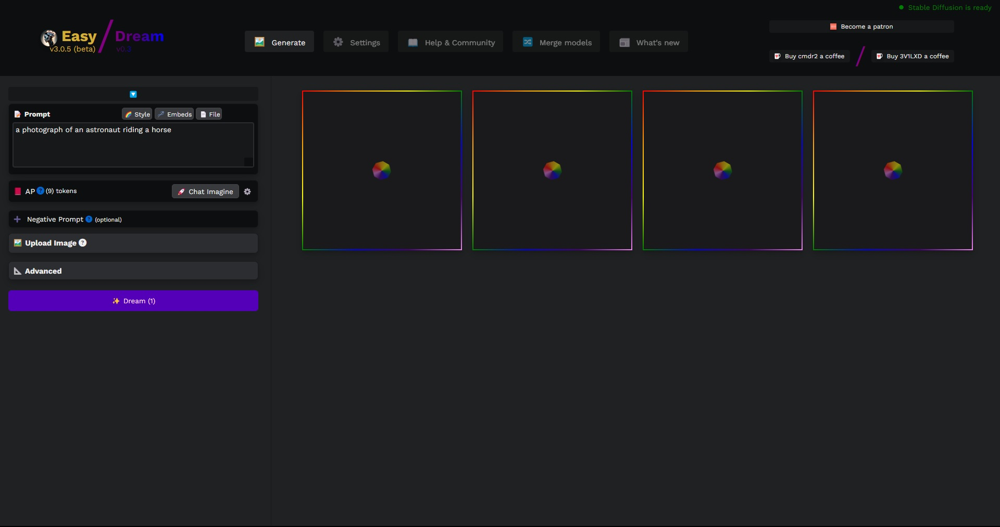

# Easy Dream Studio for Easy Diffusion

## Description

Easy Dream Studio (EDS) is a transformative plugin for the Easy Diffusion (ED) application that aims to replicate the UI of Stability.ai's Dream Studio. As a front-end for the image-generating software Stable Diffusion, Dream Studio's UI has inspired the design of EDS. Leveraging the similar UI structure of ED, the EDS plugin applies a series of changes to create a similar appearance and functionality of Dream Studio, offering users a familiar and intuitive experience while using Easy Diffusion.

## Features

- Replicates the UI of Dream Studio
- Editor can snap closed
- Editor menus pop out (landscape mode)
- Splitter resizes Editor and Preview (landscape mode)
- Preview is responsive
- Show Details button to toggle img details
- Preview img details hidden by default unless rendering
- Hiding details reduces clutter around imgs and displayed in natural size
- Fullscreen Mode (hides Editor and Top Nav)
- Responsive

## Installation

- Download raw file from src/EasyDreamStudio.plugin.js
- Place file in your plugins folder
- Refresh Easy Diffusion UI

## Support and Community

If you need help or have questions about this application, the best way to get support is by joining the Discord.

To join the Discord, click on this invite link: [Discord](https://discord.com/invite/aP9CjWE)

## Support and Donations

If you enjoy using this project and find it helpful, please consider supporting its development. Your support helps to ensure the project's continued development, bug fixes, and improvements.

### Other Ways to Support

- Share this project.
- Report any issues you encounter or suggest new features and improvements by creating a new issue on the GitHub repository.
- Contribute to the project by submitting pull requests with bug fixes, new features, or improvements to the code or documentation.
- Star the repository on GitHub to show your appreciation for the project.
- Show your support on social media. [Linktree](https://linktr.ee/3v1lxd)

### Donations

If you would like to make a financial contribution to support development, you can donate using the following method:

- [PayPal](https://paypal.me/ScottDIT)

Your donation, no matter the size, is greatly appreciated and will help to support future development and maintenance. Thank you for your generosity!
